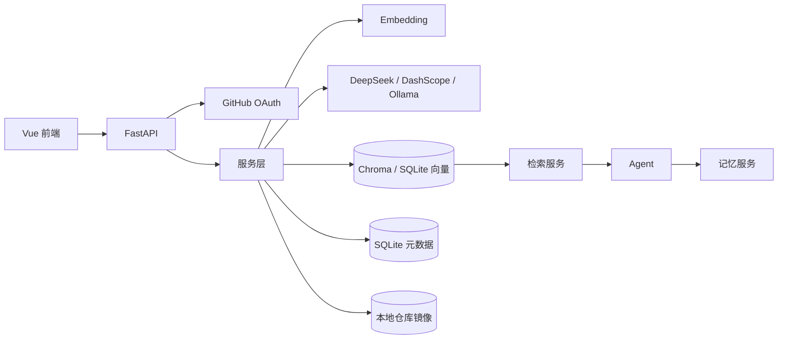

# MyAgentic

> 本地单用户、面向 GitHub 公开仓库的 Agentic RAG 项目。

> ✨✨✨开发练习中，待完善。。。。。
> 最近更新：2026-08-06


MyAgentic 让用户通过 GitHub OAuth 登录后，把自己维护的公开仓库同步到本地，建立向量索引，并通过 Agent 跨项目问答代码、文档和图片。回答会附上来源文件路径，便于跳转到本地镜像查看原文。

## 核心功能

- GitHub OAuth 登录、会话保持与退出登录。
- 自动拉取用户公开仓库列表，区分未入库、索引中、已入库和失败状态。
- 支持导入任意 `github.com/owner/repo` 公开仓库 URL。
- 异步入库：clone 仓库、扫描文件、解析代码/文档/图片、生成向量、写入本地存储。
- 增量更新：按文件 hash 只处理变化文件，删除已移除文件的旧向量。
- 混合检索：向量检索 + 关键词匹配 + 路径匹配，支持项目、文件类型和语言过滤。
- 项目级技术栈摘要：建库时生成项目技术栈，支持“哪个仓库用了 Vue/FastAPI”类问题。
- 项目概览：优先从项目摘要、README 和 docs 目录生成项目概览结果。
- 同步日志：记录仓库同步与入库结果，仓库页可查看历史日志。
- 索引摘要：入库后自动生成文件数量、类型、语言、目录和 README 摘录。
- Agent 问答：支持 DeepSeek、阿里云 DashScope 和本地 Ollama；DeepSeek 常驻，调用失败时自动降级到 Ollama 保底，均失败时明确返回本地检索兜底回答。
- 记忆系统：保存会话消息、会话摘要、长期记忆，支持记忆 CRUD API。
- 记忆管理：前端页面支持按项目/类型筛选、新建、编辑和删除记忆。
- 聊天会话管理：支持会话列表、历史消息加载、重命名和删除。
- 图片检索：图片先通过图生文 API 生成描述再索引，保留原图预览。
- 流式回答：前端使用 SSE 接收 Agent 回答。

## 当前状态

已实现：

- 后端 FastAPI API 与 SQLite 元数据。
- Vue 3 + Vite + Element Plus 前端。
- GitHub OAuth、仓库列表、异步入库、增量索引。
- 检索服务、Agent 基础流程、记忆 CRUD。
- 同步日志、项目索引摘要、记忆管理页面。
- 聊天会话侧栏、历史消息加载、会话重命名与删除。
- 后端 pytest 测试与前端 Vitest 测试。
- 本地 ONNX embedding（`bge-small-zh-v1.5`，512 维）、Chroma、LangGraph 状态流。
- SSE 逐 token 流式回答、Markdown 渲染与来源卡片。
- 聊天消息持久化工具与模式，历史会话重新加载后保留标签。
- 长期记忆中文分词召回、按项目隔离，会话摘要自动去重更新。
- 显式项目检索不跨项目兜底，图片/文档专用检索不降级为其他类型。
- 检索与记忆链路已用真实数据验证：显式项目图片检索、项目概述、长期记忆中文召回。
- 真实浏览器登录、6 个公开仓库已完成 Chroma 全量重建，当前 4697 条向量。
- `general_chat` 输出越界校验，以及检索后重排、LLM 相关性校验与多轮重试。

待完成：

- `git_rag_agentic_demo` 因缺少本地镜像且 GitHub 网络当前不可用，暂未重建。
- Agent 真实模型问答（DeepSeek 出网、本地 Ollama 服务恢复后）、图生文真实 API 与浏览器端到端验收。

## 技术栈

| 层次 | 选型 |
|------|------|
| 后端 | Python 3.13、FastAPI、Uvicorn |
| 数据 | SQLAlchemy 2、aiosqlite、SQLite |
| 向量存储 | Chroma（当前）、SQLiteVectorStore（兜底） |
| Embedding | 本地 ONNX `bge-small-zh-v1.5`（当前）、HashEmbedding（兜底） |
| Agent | LangGraph 状态流（当前） |
| LLM | DeepSeek、阿里云 DashScope、本地 Ollama |
| 前端 | Vue 3、Vite、Element Plus、Pinia、Vue Router |
| 测试 | pytest、pytest-asyncio、Vitest、Vue Test Utils |
| 代码质量 | ruff |

## 架构



## 数据如何转为向量

仓库入库时，数据按以下流程转换为向量：

```text
git clone
→ 扫描文件
→ 识别代码/文档/图片
→ 按文件内容分块
→ 对文本块生成向量
→ 写入向量存储并保存 metadata
```

代码文件会尽量按函数、类等结构切块，无法识别时按行数回退；文档文件按行数和重叠窗口切块；图片文件先调用图生文 API 生成中文描述，再把描述转为向量，原始图片仍保留在本地镜像中。

默认使用本地 ONNX 模型 `BAAI/bge-small-zh-v1.5`，向量维度为 512；未配置模型时回退到内置的 `HashEmbedding` 兜底：

- 把文本按中英文单词切分。
- 用 SHA-256 把每个词映射到 64 个向量桶。
- 统计每个桶的词频。
- 对向量做 L2 归一化，得到 64 维向量。

这种方式的优点是本地、零依赖、速度快；缺点是语义表达能力有限，只作为开发兜底。

向量写入 Chroma 持久化存储；检索时使用“向量候选 + 独立关键词/路径候选”的并集融合，并按项目、文件类型和语言过滤。

## 目录结构

```text
MyAgentic/
├── backend/
│   ├── app/
│   │   ├── api/          # FastAPI 路由
│   │   ├── services/     # 业务服务
│   │   ├── models.py     # SQLAlchemy 模型
│   │   ├── schemas.py    # Pydantic 模型
│   │   └── main.py       # 应用入口
│   └── tests/
├── frontend/
│   ├── src/
│   │   ├── api/
│   │   ├── router/
│   │   ├── stores/
│   │   └── views/
│   └── package.json
├── docs/                 # 项目文档
├── data/                 # 本地数据，不入库
├── storage/              # 向量库，不入库
├── .env.example
├── pyproject.toml
├── uv.lock
└── README.md
```

# 可视化展示

> 针对 code、img等数据入库展示


> 阿里云图生文模型针对图像数据
> 图生文 -> 文本转为向量 -> 向量作为元数据与图片组合作为索引 -> 检索图片
> 当前图片描述索引与检索链路已实现；真实图生文 API 需配置 `DASHSCOPE_VL_MODEL` 后验收。


## 快速开始

### 1. 环境要求

- Git
- Python 3.13
- uv
- Node.js 18+
- npm

### 2. 初始化配置

```powershell
cd E:\mmmmmmmmmmmmmmmm\MyAgentic
Copy-Item .env.example .env
```

在 `.env` 中填写：

```text
GITHUB_CLIENT_ID=
GITHUB_CLIENT_SECRET=
GITHUB_CALLBACK_URL=http://127.0.0.1:8000/api/auth/callback
SESSION_SECRET=
APP_SECRET_KEY=
```

`GITHUB_CALLBACK_URL` 必须与 GitHub OAuth App 中配置的回调地址完全一致。

### 3. 启动后端

```powershell
cd E:\mmmmmmmmmmmmmmmm\MyAgentic
uv sync
uv run python -m backend.app
```

后端默认运行在：

```text
http://127.0.0.1:8000
```

健康检查：

```text
http://127.0.0.1:8000/api/health
```

### 4. 启动前端

```powershell
cd E:\mmmmmmmmmmmmmmmm\MyAgentic\frontend
npm install
npm run dev
```

前端默认运行在：

```text
http://127.0.0.1:5173
```

请使用 `127.0.0.1` 访问，不要使用 `localhost`。

## GitHub OAuth 配置

1. 打开 GitHub 的 Developer settings。
2. 创建 OAuth App。
3. Homepage URL 填写 `http://127.0.0.1:5173`。
4. Authorization callback URL 填写 `http://127.0.0.1:8000/api/auth/callback`。
5. 复制 Client ID 和 Client Secret 到 `.env`。
6. 重启后端。

## 使用流程

1. 打开前端并点击“使用 GitHub 登录”。
2. 在仓库列表中选择一个公开仓库，点击“入库”。
3. 等待状态变为“已入库”。
4. 进入“聊天”页面提问，例如：
   - “这个项目大致有什么？”
   - “登录功能是怎么实现的？”
   - “README 里的安装步骤是什么？”
   - “有没有 logo 或截图？”
5. 在“模型配置”页面选择 DeepSeek、DashScope 或本地 Ollama 模型，让 Agent 使用真实模型总结回答。

## API 概览

| 方法 | 路径 | 说明 |
|------|------|------|
| GET | `/api/auth/login` | 获取 GitHub 授权地址 |
| GET | `/api/auth/callback` | GitHub OAuth 回调 |
| GET | `/api/auth/me` | 当前登录用户 |
| POST | `/api/auth/logout` | 退出登录 |
| GET | `/api/repos` | 仓库列表与索引状态 |
| GET | `/api/repos/{owner}/{repo}/logs` | 仓库同步与索引日志 |
| POST | `/api/repos/{owner}/{repo}/index` | 触发入库 |
| POST | `/api/repos/{owner}/{repo}/reindex` | 重新入库 |
| POST | `/api/repos/import` | 导入任意公开仓库 URL 并入库 |
| DELETE | `/api/repos/{owner}/{repo}/index` | 删除索引 |
| GET | `/api/jobs/{job_id}` | 入库任务状态 |
| GET | `/api/search` | 检索代码/文档/图片 |
| GET | `/api/search/overview` | 项目概览检索 |
| POST | `/api/chat` | Agent 问答 |
| POST | `/api/chat/stream` | Agent 流式问答 |
| GET | `/api/chat/sessions` | 当前用户会话列表 |
| POST | `/api/chat/sessions` | 新建会话 |
| GET | `/api/chat/sessions/{id}/messages` | 会话历史消息 |
| PUT | `/api/chat/sessions/{id}` | 重命名会话 |
| DELETE | `/api/chat/sessions/{id}` | 删除会话 |
| GET | `/api/files/{owner}/{repo}/{path}` | 访问本地镜像文件 |
| GET/PUT | `/api/config/model` | 读取/保存模型配置 |
| GET | `/api/config/model/catalog` | 服务商与可用模型目录 |
| GET/POST | `/api/memory` | 记忆列表/创建 |
| PUT/DELETE | `/api/memory/{id}` | 记忆更新/删除 |

## Agent 工具与触发规则

| 工具 | 触发条件 | 说明 |
|------|----------|------|
| `direct` | 问候或询问模型身份 | 直接回答，不检索 |
| `project_intro` | “介绍一下/项目是什么/概述” | 直接读取项目摘要，不触发向量检索 |
| `app_guide` | 咨询应用使用方式、入库/同步/支持能力 | 直接回答，不检索 |
| `repo_meta` | “最早/最近/哪个仓库/按时间排序” | 查询仓库元数据，不向量检索 |
| `repo_tech` | “技术栈/框架/哪个仓库用了 X” | 项目级技术栈摘要检索 |
| `read_file` | 消息包含 `读取 owner/repo/路径` | 读取本地镜像文件 |
| `overview` | 包含“概览/项目介绍/项目有什么/目录结构” | 项目概览检索 |
| `image_search` | 包含“图片/截图/logo/banner” | 图片描述检索 |
| `doc_search` | 包含“文档/说明/readme/手册/教程” | 文档检索 |
| `search` | 默认路径 | 向量 + 关键词混合检索 |

聊天回答会显示实际使用的工具标签。来源卡片只展示文件路径、类型和“查看文件/图片”入口，不再内嵌大段代码，需要原文时点击链接查看。

配置模型后，Agent 会先用 `ToolSelection`（Pydantic 模型 + Field 描述）让 LLM 选择工具，再决定是否检索；未配置模型时才使用正则规则兜底。

## 测试

后端：

```powershell
cd E:\mmmmmmmmmmmmmmmm\MyAgentic
uv run ruff check backend
uv run pytest
```

前端：

```powershell
cd E:\mmmmmmmmmmmmmmmm\MyAgentic\frontend
npm test -- --run
npm run build
```

## 文档

详细文档见：

- [01-项目要求.md](docs/01-项目要求.md)
- [02-项目内容.md](docs/02-项目内容.md)
- [03-技术栈.md](docs/03-技术栈.md)
- [04-长任务流.md](docs/04-长任务流.md)
- [05-向量数据库设计.md](docs/05-向量数据库设计.md)
- [06-注意的问题.md](docs/06-注意的问题.md)
- [07-任务清单.md](docs/07-任务清单.md)
- [08-交接日志.md](docs/08-交接日志.md)
- [09-发布清单.md](docs/09-发布清单.md)
- [10-验收标准.md](docs/10-验收标准.md)
- [11-检索能力问题分析.md](docs/11-检索能力问题分析.md)

## Git 上传准备

上传到 GitHub 前请阅读 [09-发布清单.md](docs/09-发布清单.md)，重点确认：

- `.env`、`data/`、`storage/`、`.venv/`、`node_modules/` 未被提交。
- 日志、缓存和临时截图已被 `.gitignore` 排除。
- 后端测试、前端测试和构建均通过。
- `README.md` 与当前功能状态一致。

功能验收标准见 [10-验收标准.md](docs/10-验收标准.md)。

## 常见问题

### 登录后显示“GitHub 授权未完成”

- 确认后端能访问 `https://github.com`。
- 确认 `8000` 端口只有一个后端进程。
- 确认 GitHub OAuth App 回调地址与 `.env` 一致。

### 仓库列表为空

- 检查浏览器 Network 中 `/api/repos` 是否返回 502。
- 确认后端日志没有 `full_name` 相关约束错误。
- 点击“刷新列表”重新同步 GitHub 仓库。

### 入库很慢

- 首次入库需要 clone 整个仓库，仓库越大越慢。
- 当前使用本地 ONNX 模型，按 32 条一批写入 Chroma，避免一次性占用过高内存。
- 仓库越大，解析和 embedding 时间越长；建议一次只重索引一个仓库。
