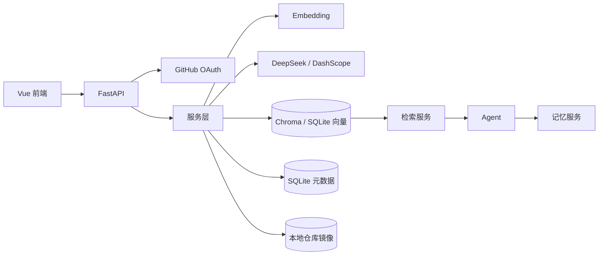
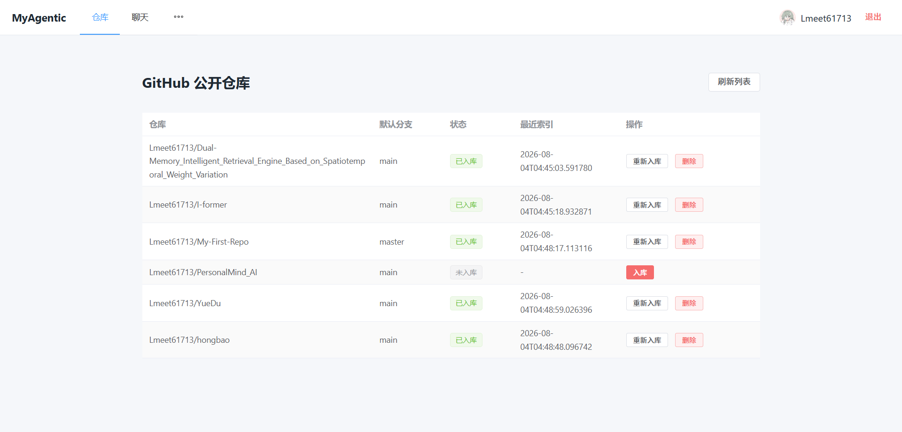
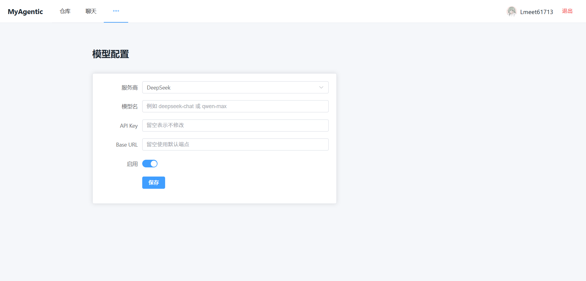

# MyAgentic

> 本地单用户、面向 GitHub 公开仓库的 Agentic RAG 项目。

> ✨✨✨开发练习中，待完善。。。。。


MyAgentic 让用户通过 GitHub OAuth 登录后，把自己维护的公开仓库同步到本地，建立向量索引，并通过 Agent 跨项目问答代码、文档和图片。回答会附上来源文件路径，便于跳转到本地镜像查看原文。

## 核心功能

- GitHub OAuth 登录、会话保持与退出登录。
- 自动拉取用户公开仓库列表，区分未入库、索引中、已入库和失败状态。
- 异步入库：clone 仓库、扫描文件、解析代码/文档/图片、生成向量、写入本地存储。
- 增量更新：按文件 hash 只处理变化文件，删除已移除文件的旧向量。
- 混合检索：向量检索 + 关键词匹配 + 路径匹配，支持项目、文件类型和语言过滤。
- 项目概览：优先从 README 和 docs 目录生成项目概览结果。
- Agent 问答：支持 DeepSeek 和阿里云 DashScope，未配置模型时使用带来源的本地兜底回答。
- 记忆系统：保存会话消息、会话摘要、长期记忆，支持记忆 CRUD API。
- 图片检索：图片先通过图生文 API 生成描述再索引，保留原图预览。
- 流式回答：前端使用 SSE 接收 Agent 回答。

## 当前状态

已实现：

- 后端 FastAPI API 与 SQLite 元数据。
- Vue 3 + Vite + Element Plus 前端。
- GitHub OAuth、仓库列表、异步入库、增量索引。
- 检索服务、Agent 基础流程、记忆 CRUD。
- 后端 pytest 测试与前端 Vitest 测试。

待完成：

- 接入真实 ONNX embedding，替换 Hash fallback。
- 安装并验证 Chroma，替换 SQLite 向量兜底。
- 使用 LangGraph 定义 Agent 状态流和多轮工具调用。
- 生成项目索引摘要和同步日志。
- 真实仓库端到端联调与更多前端组件测试。

## 技术栈

| 层次 | 选型 |
|------|------|
| 后端 | Python 3.13、FastAPI、Uvicorn |
| 数据 | SQLAlchemy 2、aiosqlite、SQLite |
| 向量存储 | Chroma（规划）、SQLiteVectorStore（当前兜底） |
| Embedding | 本地 ONNX（规划）、HashEmbedding（当前兜底） |
| Agent | LangGraph（规划）、当前简化工具流程 |
| LLM | DeepSeek、阿里云 DashScope |
| 前端 | Vue 3、Vite、Element Plus、Pinia、Vue Router |
| 测试 | pytest、pytest-asyncio、Vitest、Vue Test Utils |
| 代码质量 | ruff |

## 架构



## 目录结构

```text
MyAgentic/
├── backend/
│   ├── app/
│   │   ├── api/          # FastAPI 路由
│   │   ├── services/     # 业务服务
│   │   ├── models.py     # SQLAlchemy 模型
│   │   ├── schemas.py    # Pydantic 模型
│   │   └── main.py       # 应用入口
│   └── tests/
├── frontend/
│   ├── src/
│   │   ├── api/
│   │   ├── router/
│   │   ├── stores/
│   │   └── views/
│   └── package.json
├── docs/                 # 项目文档
├── data/                 # 本地数据，不入库
├── storage/              # 向量库，不入库
├── .env.example
├── pyproject.toml
├── uv.lock
└── README.md
```

# 可视化展示

> 针对 code、img等数据入库展示


> 待用大模型达成召回

> 阿里云图生文模型针对图像数据
> 图生文 -> 文本转为向量 -> 向量作为元数据与图片组合作为索引 -> 检索图片

> 待开发ing


## 快速开始

### 1. 环境要求

- Git
- Python 3.13
- uv
- Node.js 18+
- npm

### 2. 初始化配置

```powershell
cd E:\mmmmmmmmmmmmmmmm\MyAgentic
Copy-Item .env.example .env
```

在 `.env` 中填写：

```text
GITHUB_CLIENT_ID=
GITHUB_CLIENT_SECRET=
GITHUB_CALLBACK_URL=http://127.0.0.1:8000/api/auth/callback
SESSION_SECRET=
APP_SECRET_KEY=
```

`GITHUB_CALLBACK_URL` 必须与 GitHub OAuth App 中配置的回调地址完全一致。

### 3. 启动后端

```powershell
cd E:\mmmmmmmmmmmmmmmm\MyAgentic
uv sync
uv run python -m backend.app
```

后端默认运行在：

```text
http://127.0.0.1:8000
```

健康检查：

```text
http://127.0.0.1:8000/api/health
```

### 4. 启动前端

```powershell
cd E:\mmmmmmmmmmmmmmmm\MyAgentic\frontend
npm install
npm run dev
```

前端默认运行在：

```text
http://127.0.0.1:5173
```

请使用 `127.0.0.1` 访问，不要使用 `localhost`。

## GitHub OAuth 配置

1. 打开 GitHub 的 Developer settings。
2. 创建 OAuth App。
3. Homepage URL 填写 `http://127.0.0.1:5173`。
4. Authorization callback URL 填写 `http://127.0.0.1:8000/api/auth/callback`。
5. 复制 Client ID 和 Client Secret 到 `.env`。
6. 重启后端。

## 使用流程

1. 打开前端并点击“使用 GitHub 登录”。
2. 在仓库列表中选择一个公开仓库，点击“入库”。
3. 等待状态变为“已入库”。
4. 进入“聊天”页面提问，例如：
   - “这个项目大致有什么？”
   - “登录功能是怎么实现的？”
   - “README 里的安装步骤是什么？”
   - “有没有 logo 或截图？”
5. 在“模型配置”页面填写 DeepSeek 或阿里云 API Key，让 Agent 使用真实模型总结回答。

## API 概览

| 方法 | 路径 | 说明 |
|------|------|------|
| GET | `/api/auth/login` | 获取 GitHub 授权地址 |
| GET | `/api/auth/callback` | GitHub OAuth 回调 |
| GET | `/api/auth/me` | 当前登录用户 |
| POST | `/api/auth/logout` | 退出登录 |
| GET | `/api/repos` | 仓库列表与索引状态 |
| POST | `/api/repos/{owner}/{repo}/index` | 触发入库 |
| POST | `/api/repos/{owner}/{repo}/reindex` | 重新入库 |
| DELETE | `/api/repos/{owner}/{repo}/index` | 删除索引 |
| GET | `/api/jobs/{job_id}` | 入库任务状态 |
| GET | `/api/search` | 检索代码/文档/图片 |
| GET | `/api/search/overview` | 项目概览检索 |
| POST | `/api/chat` | Agent 问答 |
| POST | `/api/chat/stream` | Agent 流式问答 |
| GET | `/api/files/{owner}/{repo}/{path}` | 访问本地镜像文件 |
| GET/PUT | `/api/config/model` | 读取/保存模型配置 |
| GET/POST | `/api/memory` | 记忆列表/创建 |
| PUT/DELETE | `/api/memory/{id}` | 记忆更新/删除 |

## 测试

后端：

```powershell
cd E:\mmmmmmmmmmmmmmmm\MyAgentic
uv run ruff check backend
uv run pytest
```

前端：

```powershell
cd E:\mmmmmmmmmmmmmmmm\MyAgentic\frontend
npm test -- --run
npm run build
```

## 文档

详细文档见：

- [01-项目要求.md](docs/01-项目要求.md)
- [02-项目内容.md](docs/02-项目内容.md)
- [03-技术栈.md](docs/03-技术栈.md)
- [04-长任务流.md](docs/04-长任务流.md)
- [05-向量数据库设计.md](docs/05-向量数据库设计.md)
- [06-注意的问题.md](docs/06-注意的问题.md)
- [07-任务清单.md](docs/07-任务清单.md)
- [08-交接日志.md](docs/08-交接日志.md)
- [09-发布清单.md](docs/09-发布清单.md)

## Git 上传准备

上传到 GitHub 前请阅读 [09-发布清单.md](docs/09-发布清单.md)，重点确认：

- `.env`、`data/`、`storage/`、`.venv/`、`node_modules/` 未被提交。
- 日志、缓存和临时截图已被 `.gitignore` 排除。
- 后端测试、前端测试和构建均通过。
- `README.md` 与当前功能状态一致。

## 常见问题

### 登录后显示“GitHub 授权未完成”

- 确认后端能访问 `https://github.com`。
- 确认 `8000` 端口只有一个后端进程。
- 确认 GitHub OAuth App 回调地址与 `.env` 一致。

### 仓库列表为空

- 检查浏览器 Network 中 `/api/repos` 是否返回 502。
- 确认后端日志没有 `full_name` 相关约束错误。
- 点击“刷新列表”重新同步 GitHub 仓库。

### 入库很慢

- 首次入库需要 clone 整个仓库，仓库越大越慢。
- 当前使用 Hash fallback 向量，不需要额外模型。
- 接入 ONNX/Chroma 后，检索质量会提升，但入库时间主要仍取决于仓库体积。
