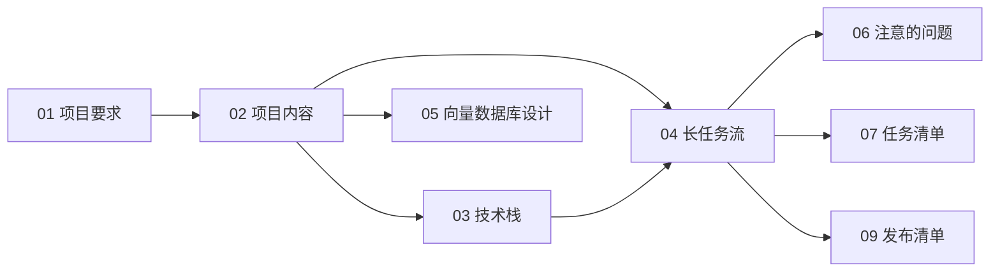

# 文档索引

> 最近更新：2026-08-04

MyAgentic 项目文档，按阅读顺序排列。

| 文档 | 用途 | 状态 |
|------|------|------|
| [00-文档索引.md](00-文档索引.md) | 文档导航 | 最新 |
| [01-项目要求.md](01-项目要求.md) | 目标、范围、功能与非功能需求、验收 | 维护中 |
| [02-项目内容.md](02-项目内容.md) | 定位、架构、模块职责、数据流、查询路由、API | 维护中 |
| [03-技术栈.md](03-技术栈.md) | 技术选型、目录结构、环境变量、依赖清单 | 维护中 |
| [04-长任务流.md](04-长任务流.md) | 分阶段实施、依赖、交付物、验收、风险 | 维护中 |
| [05-向量数据库设计.md](05-向量数据库设计.md) | Chroma 数据模型、metadata、增量更新 | 维护中 |
| [06-注意的问题.md](06-注意的问题.md) | 跨模块注意事项与安全检查项 | 维护中 |
| [07-任务清单.md](07-任务清单.md) | 阶段任务快速清单 | 维护中 |
| [08-交接日志.md](08-交接日志.md) | 交接状态、时间线、完成/未完成事项 | 维护中 |
| [09-发布清单.md](09-发布清单.md) | Git 上传前检查、提交步骤、待办与注意事项 | 最新 |

## 阅读路径

新成员先了解产品目标和架构：

```text
01-项目要求.md → 02-项目内容.md → 03-技术栈.md
```

进入实施时参考：

```text
04-长任务流.md（阶段执行）
05-向量数据库设计.md（向量数据细节）
06-注意的问题.md（跨模块约束）
07-任务清单.md（进度快查）
08-交接日志.md（交接状态）
09-发布清单.md（Git 上传准备）
```

## 文档关系


