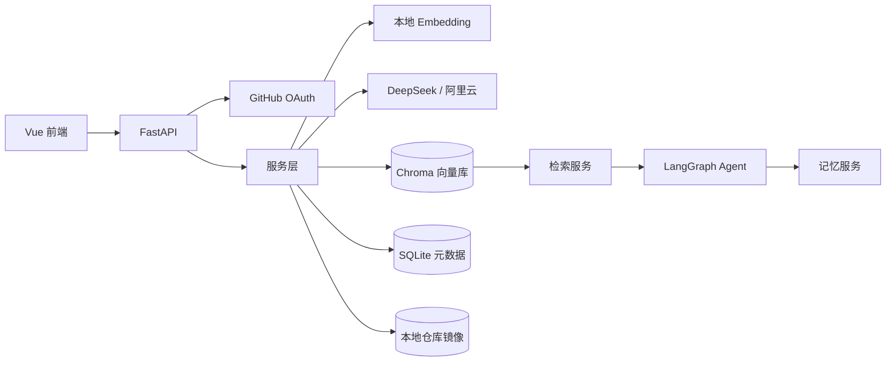
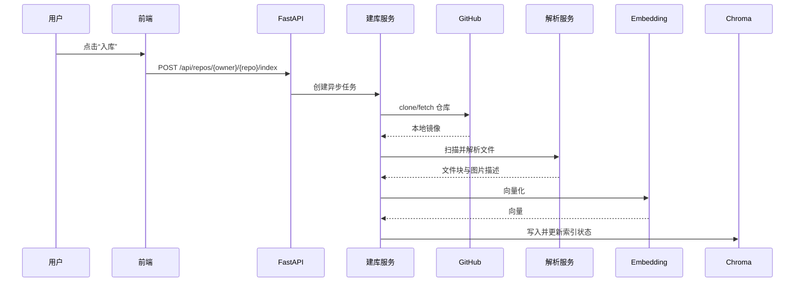
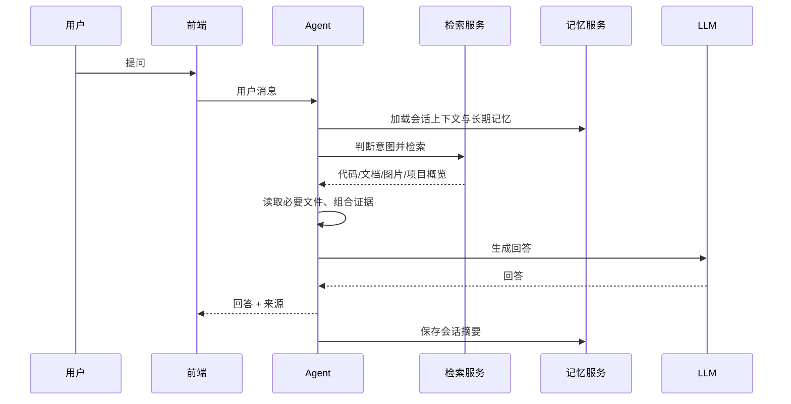

# 项目内容

> 文档状态：规划稿  
> 最近更新：2026-08-06
> 关联文档：[01-项目要求.md](01-项目要求.md)、[05-向量数据库设计.md](05-向量数据库设计.md)

## 1. 项目是什么

MyAgentic 不是普通单仓库 RAG，而是面向多个 GitHub 项目的本地 Agentic RAG。

普通 RAG：

```text
问题 → 一个知识库 → top-k 文本块 → 回答
```

MyAgentic：

```text
问题 → Agent 判断意图
→ 选择项目或跨项目检索
→ 检索代码/文档/图片
→ 读取必要文件
→ 组合证据
→ 生成带来源的回答
```

## 2. 核心概念

### 2.1 项目级

每个 GitHub 仓库是一个逻辑项目。

向量库中不单独建立物理项目库，而是通过 project_id 做逻辑隔离：

```text
project_id = owner/repo
```

### 2.2 文件级

每个项目内部包含：

- 代码文件
- 文档文件
- 图片文件
- 配置文件
- 其他资源文件

代码、文档和图片使用不同的处理方式。

### 2.3 检索类型

| 类型 | 内容 | 索引方式 |
|------|------|----------|
| code | 函数/类等代码片段 | 代码上下文 + 通用文本向量 |
| doc | Markdown、文档、说明文件 | 转换 Markdown 后分块向量化 |
| image | 图片描述 | 图生文 API 生成描述后向量化，保留原图路径 |

## 3. 总体架构



## 4. 模块划分与职责

### 4.1 前端层

| 模块 | 职责 |
|------|------|
| GitHub 登录页 | 跳转 OAuth、处理登录状态 |
| 仓库列表页 | 展示仓库、入库状态、触发入库/删除 |
| 聊天界面 | 提问、流式回答、展示检索来源 |
| 模型配置界面 | 配置服务商、模型名、API Key |
| 检索来源展示 | 代码块、文档片段、图片预览、文件路径 |

### 4.2 后端层

| 模块 | 职责 | 主要输入/输出 |
|------|------|----------------|
| GitHub OAuth | 授权、回调、会话 | 浏览器跳转 / 登录状态 |
| 仓库元数据服务 | 仓库列表、状态合并 | GitHub API / repos 表 |
| 仓库同步服务 | clone、fetch、commit 记录 | GitHub 仓库 / 本地镜像 |
| 文件解析服务 | 扫描、类型识别、分块、图生文 | 镜像文件 / 文件清单 |
| Embedding 核心 | 文本向量化 | 文本 / 向量 |
| 异步建库服务 | 任务状态、阶段调度 | 入库请求 / 任务状态 |
| 检索服务 | 向量 + 关键词 + metadata 过滤 | 查询 / 检索结果 |
| Agent 编排 | 意图判断、工具调用、回答生成 | 用户问题 / 回答与来源 |
| 记忆服务 | 会话上下文、长期记忆 | 消息 / 记忆片段 |
| 配置服务 | 模型配置、加密 API Key | 表单 / 加密配置 |
| 文件服务 | 提供镜像内图片和文档访问 | 路径 / 文件内容 |

### 4.3 数据层

| 存储 | 内容 |
|------|------|
| Chroma 向量库 | 代码、文档、图片描述、项目摘要向量 |
| SQLite 元数据 | 用户、仓库、任务、文件、会话、记忆、模型配置 |
| 本地仓库镜像 | data/repos/<owner>/<repo>/ |
| 加密配置 | .env 与加密后的 API Key |

## 5. 主要数据流

### 5.1 建库数据流



### 5.2 问答数据流



## 6. 查询路由规则

| 用户意图 | 路由 | 数据来源 | 示例问题 |
|----------|------|----------|----------|
| 项目概览 | project_overview | README、文件树、项目元数据 | “这个项目大致有什么” |
| 项目介绍 | project_intro | 项目摘要 | “简单介绍一下 Lmeet61713/YueDu” |
| 技术栈检索 | repo_tech | 项目级技术栈摘要 | “哪个仓库用了 Vue/FastAPI” |
| 功能实现 | search_code | 代码向量 + 关键词 | “某个功能怎么实现的” |
| 文档说明 | search_docs | 文档向量 | “这个文档里怎么说” |
| 图片资源 | search_images | 图片描述向量 + 路径关键词 | “有没有登录页截图” |
| 跨项目关联 | cross_project | 全 collection 混合检索 | “找出所有和 X 相关的内容” |
| 会话追问 | memory_only | 会话上下文 | “刚才那个项目呢” |

兜底规则：

- 意图不明确时先做跨项目、跨类型混合检索，由 Agent 判断相关性。
- 未检索到内容时明确回答“未找到”，不编造来源。
- 用户问题未指定项目时默认跨项目检索，指定项目时用 project_id 过滤。

## 7. 数据模型概览

### 7.1 SQLite 表

| 表 | 关键字段 | 说明 |
|------|----------|------|
| users | id, github_id, username, avatar, token_enc | GitHub 用户信息 |
| repos | id, user_id, owner, repo, full_name, default_branch, last_commit_sha, index_status, summary | 仓库元数据与索引状态 |
| index_jobs | id, repo_id, status, stage, progress, error | 异步入库任务 |
| indexed_files | id, repo_id, path, file_type, language, file_hash, size | 已索引文件清单 |
| sync_logs | id, repo_id, action, status, message, commit_sha | 同步与索引日志 |
| chat_sessions | id, user_id, title, created_at | 会话 |
| chat_messages | id, session_id, role, content, sources, tool, mode | 聊天记录 |
| memory_entries | id, user_id, session_id, project_id, type, content | 长期记忆 |
| model_configs | id, provider, model_name, api_key_enc | 模型配置 |

### 7.2 Chroma 记录

Chroma 使用一个主 collection，通过 metadata 区分 project_id、file_type、language、path。字段设计和增量更新规则见 [05-向量数据库设计.md](05-向量数据库设计.md)。

## 8. API 契约概览

以下为规划草案，实现时以实际路由为准。

| 方法 | 路径 | 说明 |
|------|------|------|
| GET | /api/auth/login | 跳转 GitHub 授权 |
| GET | /api/auth/callback | OAuth 回调 |
| GET | /api/auth/me | 当前用户 |
| POST | /api/auth/logout | 退出登录 |
| GET | /api/repos | 仓库列表与入库状态 |
| POST | /api/repos/{owner}/{repo}/index | 触发入库 |
| POST | /api/repos/{owner}/{repo}/reindex | 重新入库 |
| DELETE | /api/repos/{owner}/{repo}/index | 删除入库 |
| POST | /api/repos/import | 导入任意公开仓库 URL 并入库 |
| GET | /api/repos/{owner}/{repo}/logs | 仓库同步与索引日志 |
| GET | /api/jobs/{job_id} | 任务详情 |
| GET | /api/search | 直接检索 |
| GET | /api/search/overview | 项目概览检索 |
| POST | /api/chat | Agent 问答 |
| POST | /api/chat/stream | Agent 流式问答，SSE 返回 |
| GET/POST | /api/chat/sessions | 会话列表/新建 |
| GET | /api/chat/sessions/{id}/messages | 会话历史消息 |
| PUT/DELETE | /api/chat/sessions/{id} | 重命名/删除会话 |
| GET | /api/files/{owner}/{repo}/{path} | 访问镜像内文件 |
| GET/PUT | /api/config/model | 读取/保存模型配置 |
| GET | /api/config/model/catalog | 服务商与可用模型目录 |
| GET/POST | /api/memory | 记忆列表/创建 |
| PUT/DELETE | /api/memory/{id} | 记忆更新/删除 |

## 9. 参考 Demo 的复用方式

三个 demo 脚本的作用：

| 脚本 | 参考内容 |
|------|----------|
| autism_rag_offline.py | 离线文档转换、分块、向量化、Chroma 持久化 |
| autism_agentic_rag_service.py | LangChain Agent、检索工具、结构化输出 |
| local_onnx_embedding_core.py | 本地 ONNX embedding 适配 LlamaIndex/LangChain |

MyAgentic 不会直接复制 demo 的孤独症领域逻辑，而是复用其中稳定可靠的技术模式。

## 10. 当前完成项

- [x] 确定 MyAgentic 的内容边界。
- [x] 确定代码、文档、图片三类检索内容。
- [x] 确定逻辑层级采用 project_id 元数据。
- [x] 确认参考 10_rag 的三个 demo 脚本。
- [x] 补充模块职责、数据模型和 API 契约草案。
- [x] 将 demo 模式迁移到 MyAgentic 模块（ONNX + Chroma 已接入）。
- [x] 接入 LangGraph 状态流、SSE 逐 token 流式与项目级技术栈摘要。
- [x] 完成记忆 CRUD、会话管理、检索后重排与显式项目防跨项目污染。
