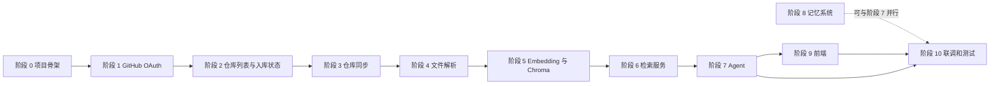
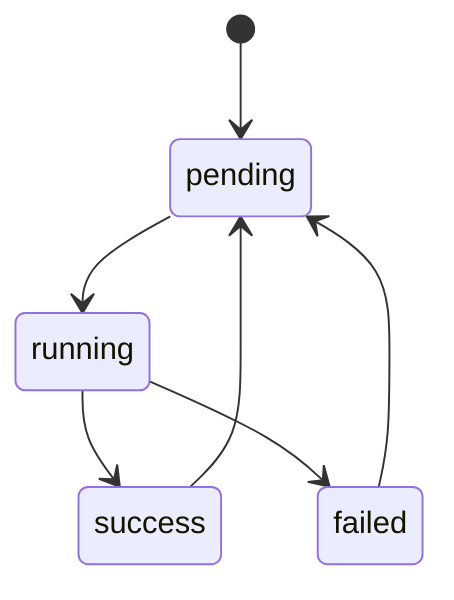
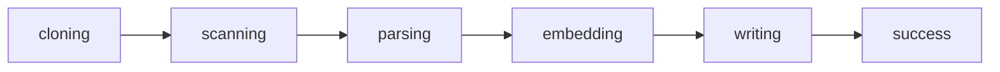

# 长任务流

> 文档状态：规划稿  
> 最近更新：2026-08-06
> 关联文档：[01-项目要求.md](01-项目要求.md)、[02-项目内容.md](02-项目内容.md)、[03-技术栈.md](03-技术栈.md)  
> 快速清单：[07-任务清单.md](07-任务清单.md)  
> 交接记录：[08-交接日志.md](08-交接日志.md)

## 1. 总体目标

从当前文档阶段推进到可运行的本地应用：用户完成 GitHub 登录，选择公开仓库入库，通过 Agent 跨项目问答代码、文档和图片。

执行原则：

- 每个阶段完成后系统仍然可运行。
- 后端能力先可用，前端随后接入。
- 任务状态持久化，失败可重试。
- 文档与代码同步更新。
- 每个阶段有明确交付物和验收标准，验收通过后再进入下一阶段。

## 2. 阶段总览与依赖

依赖说明：

- 阶段 1 到 7 是主链路，必须顺序推进。
- 阶段 8 记忆系统可在阶段 7 开发期间并行设计，但联调放在阶段 10。
- 阶段 9 前端需要阶段 7 的 Agent API 作为联调基础。
- 阶段 10 覆盖整条链路，作为最终验收。

## 3. 通用约定

### 3.1 任务状态

- pending：等待执行。
- running：正在执行。
- success：执行完成。
- failed：执行失败，保留错误信息，可重试。
- 重新入库时，已成功的任务回到 pending。

### 3.2 入库阶段

- cloning：clone 或 fetch 仓库。
- scanning：扫描文件树。
- parsing：识别类型、分块、生成图片描述。
- embedding：向量化。
- writing：写入 Chroma 并更新元数据。

### 3.3 完成定义（DoD）

阶段视为完成时，需要满足：

- 清单任务全部勾选，或明确标记为暂缓。
- 验收标准全部通过。
- 关键路径有测试或手工验证记录。
- 涉及 API 的阶段提供可调用的接口。
- 文档中对应内容已同步更新。

## 4. 阶段详情

### 阶段 0：项目骨架

目标：建立可运行的后端和前端骨架，统一命令和目录。

前置条件：项目文档已完成。

任务：

- [x] 使用 uv 初始化 MyAgentic。
- [x] 编写项目文档。
- [x] 确定后端目录 backend/app。
- [x] 确定前端目录 frontend/。
- [x] 创建 FastAPI 入口和 /api/health。
- [x] 创建 Vue + Vite 空项目。
- [x] 创建 .env.example。
- [x] 配置 ruff、pytest、Vitest。
- [x] 在 README 补齐启动命令。

交付物：可启动的后端/前端骨架、.env.example、测试框架。

验收标准：

- `uv run python -m backend.app` 可启动并访问健康检查接口。
- 前端开发服务器可启动。
- 依赖安装命令和启动命令在 README 中可复现。

主要风险：Python 3.13 与部分库的兼容性；前端脚手架依赖下载。

### 阶段 1：GitHub OAuth

目标：让用户可以在浏览器中登录 GitHub。

前置条件：阶段 0 完成；GitHub OAuth App 已注册。

任务：

- [x] 注册 GitHub OAuth App 并配置回调地址。
- [x] 配置 GITHUB_CLIENT_ID、GITHUB_CLIENT_SECRET、GITHUB_CALLBACK_URL、SESSION_SECRET。
- [x] 实现 /api/auth/login，生成授权地址并带 state。
- [x] 实现 /api/auth/callback，用 code 换取 token。
- [x] 保存用户信息和 token 到 users 表。
- [x] 实现 /api/auth/me。
- [x] 实现 /api/auth/logout。
- [x] 前端增加登录页和路由守卫。

当前范围：

- 只申请公开仓库所需权限。
- 不处理私有仓库。
- 后续要访问私有仓库时再增加 repo scope。

交付物：OAuth 登录流程、会话管理、users 表。

验收标准：

- 浏览器可完成“点击登录 → GitHub 授权 → 回到应用”。
- 刷新页面后登录状态保持，退出后失效。
- 日志和数据库中不泄露 GitHub token。
- 回调地址来自 .env，不写死。

主要风险：GitHub 回调地址配置不一致；state 校验缺失导致 CSRF。

### 阶段 2：仓库列表与入库状态

目标：展示仓库，区分已入库、未入库和索引中。

前置条件：阶段 1 完成。

任务：

- [x] 分页遍历 GitHub 公开仓库。
- [x] 保存仓库元数据到 repos 表。
- [x] 与本地索引状态合并。
- [x] 实现 /api/repos。
- [x] 前端实现仓库列表页。
- [x] 未入库仓库显示红色“入库”标签。
- [x] 已入库仓库显示“已入库”。
- [x] 索引中仓库显示“索引中”。
- [x] 提供刷新仓库列表功能。

交付物：仓库列表 API、仓库状态合并逻辑、前端列表页。

验收标准：

- 所有公开仓库能分页展示。
- 三种状态显示正确。
- 刷新后状态与后端一致。
- GitHub API 限流时给出可理解错误。

主要风险：仓库数量多导致分页慢；GitHub API rate limit。

### 阶段 3：仓库同步

目标：把用户选择的仓库同步到本地。

前置条件：阶段 2 完成。

任务：

- [x] 使用 `git clone --depth 1` 克隆公开仓库。
- [x] 管理 data/repos/<owner>/<repo>/ 镜像目录。
- [x] 保存当前 commit sha。
- [x] 支持 fetch/reset 更新到最新 commit。
- [x] 记录同步日志。
- [x] 设置仓库大小限制、大文件跳过和超时。

交付物：仓库同步服务、镜像目录管理、同步日志。

验收标准：

- 首次入库能完成 clone 并记录 commit sha。
- 重新入库能拉取最新代码并更新 commit sha。
- 超大仓库或网络失败时任务进入 failed 并保留错误信息。
- 失败后不影响其他仓库。

主要风险：大仓库克隆时间长；网络中断；磁盘占用。

### 阶段 4：文件解析

目标：把仓库内容转换为可索引结构。

前置条件：阶段 3 完成。

任务：

- [x] 扫描项目文件树。
- [x] 忽略 .git、node_modules、dist、build、.venv、__pycache__ 等目录。
- [x] 识别代码、文档、图片文件。
- [x] 代码按函数/类结构分块，无法识别时按行回退。
- [x] 文档转换为 Markdown 后分块。
- [x] 图片调用阿里云图生文 API 生成描述。
- [x] 图片描述结果缓存，避免重复调用。
- [x] 生成文件清单并写入 files 表。

交付物：文件解析服务、文件清单、图片描述缓存。

验收标准：

- 三类文件识别正确，忽略规则生效。
- 大文件、二进制文件、压缩包默认跳过并记录。
- 图生文失败时该文件标记失败，不影响整体任务。
- 所有路径和内容统一 UTF-8。

主要风险：分块质量不稳定；图生文 API 失败或费用。

### 阶段 5：Embedding 与 Chroma

目标：建立持久化向量索引。

前置条件：阶段 4 完成。

任务：

- [x] 复用或改造本地 ONNX embedding 核心。
- [x] 固定向量维度，初始化 myagentic collection。
- [x] 支持文本 embedding 和图片描述 embedding。
- [x] 设计并写入 metadata 字段。
- [x] 支持按 project_id + path 删除旧向量。
- [x] 支持增量更新，只处理变化文件。
- [x] 接入 Chroma，替换 SQLite 向量兜底。
- [x] 生成索引摘要。

交付物：Embedding 核心、Chroma 服务、增量更新逻辑。

验收标准：

- 首次入库完成全量写入。
- 重新入库只处理变化文件，并删除已删除文件的旧向量。
- 重启后向量数据仍然存在。
- metadata 过滤和按项目删除有效。

主要风险：Chroma 版本 API 变化；metadata 字段类型限制；向量维度初始化后不可改。

### 阶段 6：检索服务

目标：提供可复用检索能力。

前置条件：阶段 5 完成。

任务：

- [x] 实现向量 + 关键词混合检索。
- [x] 实现 project_id、file_type、language 过滤。
- [x] 实现 search_code、search_docs、search_images。
- [x] 实现跨项目检索。
- [x] 实现项目概览检索。
- [x] 返回来源、路径、相似度和原文片段。
- [x] 暴露 /api/search。

交付物：检索服务、检索 API。

验收标准：

- 指定项目检索只返回该项目结果。
- 跨项目检索返回多个仓库结果。
- 图片检索返回图片路径和描述。
- 空结果返回明确信息，不返回伪造内容。

主要风险：通用 embedding 对代码和中文的召回质量；关键词分词。

### 阶段 7：Agent

目标：实现 Agentic RAG 问答。

前置条件：阶段 6 完成。

任务：

- [x] 实现 LLMClient 适配层，支持 DeepSeek 和阿里云。
- [x] 接入本地 Ollama。
- [x] 问候与模型身份问题直接应答。
- [x] 应用咨询与仓库元数据工具，减少无效检索。
- [x] 实现模型服务商切换。
- [x] 使用 LangGraph 定义 Agent 状态流骨架。
- [x] 定义并实现检索、读取、概览工具。
- [x] 实现多轮工具调用、检索后重排与相关性纠错。
- [x] 实现检索证据汇总。
- [x] 保证回答带来源。
- [x] 暴露 /api/chat，使用 SSE 流式返回。
- [x] 模型调用失败时返回明确错误。
- [x] 使用 Pydantic `ToolSelection` 让 LLM 结构化选工具。
- [x] 增加 `project_intro` 与非检索意图强制兜底。

交付物：Agent 编排、工具集、聊天 API。

验收标准：

- 自然语言问题能触发正确的检索工具。
- 回答包含代码/文档/图片来源。
- 切换 DeepSeek、DashScope 和 Ollama 后问答可用。
- 未检索到内容时明确说明，不编造来源。

主要风险：LangGraph 编排复杂度；模型输出不稳定；工具调用进入死循环。

### 阶段 8：记忆系统

目标：让 Agent 记住会话和项目上下文。

前置条件：可与阶段 7 并行设计；需要 chat_sessions 和 chat_messages 表。

任务：

- [x] 设计短期记忆结构。
- [x] 设计长期记忆结构。
- [x] 保存聊天记录。
- [x] 保存会话摘要。
- [x] 按 user_id、project_id 隔离长期记忆。
- [x] 实现记忆写入、检索、更新、删除工具。
- [x] 实现会话列表、历史消息、重命名和删除。
- [x] 控制长期记忆召回数量。
- [x] 防止记忆污染 Agent 上下文。

交付物：记忆服务、记忆工具、聊天记录持久化。

验收标准：

- 同一会话的追问能理解上下文。
- 长期记忆不跨用户和项目串扰。
- 记忆摘要不会被当成真实代码内容。
- 上下文超限时只召回相关记忆。

主要风险：记忆污染；摘要过期；召回数量失控。

### 阶段 9：前端

目标：提供完整交互界面。

前置条件：阶段 7 的 Agent API 可用。

任务：

- [x] 创建 Vue 项目并接入 Element Plus。
- [x] 实现 GitHub 登录页和路由守卫。
- [x] 实现仓库列表页、入库按钮和状态。
- [x] 实现聊天窗口和 SSE 流式展示。
- [x] 实现代码、文档来源展示。
- [x] 实现图片预览。
- [x] 实现模型配置界面和 API Key 更换。
- [x] 实现记忆管理页面。
- [x] 聊天窗口支持会话侧栏和历史加载。

交付物：完整前端页面和交互。

验收标准：

- 登录、仓库列表、入库、聊天、模型配置全流程可用。
- 入库状态实时反馈，不阻塞页面。
- API Key 不保存在浏览器本地。
- 长代码可折叠、可复制。

主要风险：SSE 前端兼容性；长内容渲染；Element Plus 定制成本。

### 阶段 10：联调和测试

目标：验证完整流程。

前置条件：阶段 9 完成；阶段 8 记忆系统完成。

任务：

- [x] 后端单元测试和 API 集成测试。
- [x] 前端基础组件测试。
- [ ] GitHub 登录联调（真实浏览器待重测）。
- [ ] 仓库入库联调。
- [ ] 向量检索联调。
- [ ] Agent 问答联调。
- [ ] 图片检索联调。
- [ ] 记忆系统联调。
- [x] 编写部署或启动说明。

交付物：测试套件、联调记录、启动说明。

验收标准：

- 端到端场景：登录 → 仓库列表 → 入库 → 聊天问答 → 查看来源。
- 失败场景：任务失败、模型不可用、图片 API 失败均有明确提示。
- 启动步骤在 README 中可复现。

主要风险：OAuth 难以自动化测试；本地环境差异。

## 5. 优先级与里程碑

### 5.1 优先级

| 阶段 | 优先级 | 说明 |
|------|--------|------|
| 0-7、9、10 核心链路 | P0 | MVP 必须完成 |
| 8 记忆系统 | P1 | MVP 后可立即补充 |
| 私有仓库、自动建库、自动更新、多用户 | P2 | 后续扩展 |

### 5.2 里程碑

| 里程碑 | 内容 | 对应阶段 |
|--------|------|----------|
| M0 骨架可运行 | 后端/前端空项目可启动 | 0 |
| M1 登录可用 | OAuth 登录 + 仓库列表 | 1-2 |
| M2 建库可用 | 同步 + 解析 + 向量 + 检索 API | 3-6 |
| M3 Agent 可用 | Agent 问答 + 记忆 API | 7-8 |
| M4 全流程可用 | 前端 + 联调测试 | 9-10 |

## 6. 风险与应对

| 风险 | 影响 | 应对 |
|------|------|------|
| Python 3.13 与部分库不兼容 | 依赖安装失败 | 安装时验证，必要时回退 3.12 |
| 通用 embedding 中文/代码效果差 | 检索质量低 | 已接入 ONNX 中文模型；仍需重排与相关性校验 |
| Chroma API 版本变化 | 迁移成本 | 锁定版本，封装独立存储层 |
| 超大仓库 | 磁盘和时间成本 | 大小限制、忽略规则、浅克隆 |
| BackgroundTasks 重启丢失 | 任务中断 | 状态写入 SQLite，重启后可重试 |
| 图生文 API 失败/费用 | 图片索引缺失或成本高 | 描述缓存、失败重试、单图超时 |
| GitHub API rate limit | 仓库列表刷新失败 | 分页缓存、限流提示、手动刷新 |
| OAuth 本地回调不一致 | 登录失败 | 配置集中到 .env，README 写明步骤 |
| OAuth 后端无法访问外网 | 回调时换 token 失败 | 后端必须在普通终端或非受限沙箱启动 |
| 记忆污染 Agent 上下文 | 回答错误 | 召回上限、类型区分、摘要不当作真实内容 |

### 6.1 本轮实际遇到的困难

| 困难 | 现象 | 处理与建议 |
|------|------|------------|
| 后端沙箱限制出网 | GitHub 回调返回 `httpx.ConnectError: All connection attempts failed` | 在普通终端启动后端；Codex 沙箱内启动后无法访问 GitHub token 接口 |
| 多个后端进程占用 8000 | 浏览器可能访问到旧代码，修复不生效 | 启动前用 `netstat -ano | findstr :8000` 确认只有一个监听进程，清理残留进程 |
| localhost 与 127.0.0.1 host 不一致 | OAuth state 会话丢失，返回 `invalid_state` | 登录直接请求 127.0.0.1:8000，Vite 固定 127.0.0.1，localhost 自动跳转 |
| Codex 内嵌预览拦截本地地址 | 点击 `http://127.0.0.1:5173/` 显示无法访问 | 使用系统 Chrome/Edge 手动打开本地地址 |
| uv 默认缓存目录无写权限 | `uv run` 报 cache 初始化失败 | 设置 `UV_CACHE_DIR` 到项目内目录，或直接使用 `.venv\Scripts` 下的可执行文件 |

### 6.2 当前工作点

当前交接点：GitHub 登录、仓库列表和 6 个真实仓库 Chroma + ONNX 重建已验证，当前 4697 条向量记录；URL 导入、项目级技术栈摘要、并集混合检索、置信度过滤、LangGraph 状态流、SSE 逐 token 流式、UI 重做均已完成。非仓库闲聊的输出越界校验、检索后重排与 LLM 相关性校验、多轮重试已补齐；DeepSeek 作为常驻模型、Ollama 作为自动保底模型，后端 63 项测试通过。下一步按 [10-验收标准.md](10-验收标准.md) 验收 Agent 真实问答、图片检索和记忆系统。
检索问题分析见 [11-检索能力问题分析.md](11-检索能力问题分析.md)。

## 7. 当前进度

| 阶段 | 状态 |
|------|------|
| 阶段 0 项目骨架 | 已完成，后端可启动，健康检查通过 |
| 阶段 1 GitHub OAuth | 真实浏览器登录已验证 |
| 阶段 2 仓库列表与入库状态 | 6 个公开仓库已验证 |
| 阶段 3 仓库同步 | 6 个真实仓库 clone/入库已验证，同步日志已记录 |
| 阶段 4 文件解析 | 代码完成，图片描述缓存已实现，图生文待真实 API 验证 |
| 阶段 5 Embedding 与 Chroma | ONNX + Chroma 已启用，6 个仓库已重建，当前 4697 条向量 |
| 阶段 6 检索服务 | 项目技术栈摘要、并集混合检索、置信度过滤已实现，Vue 类项目级问题已验证 |
| 阶段 7 Agent | LangGraph 状态流已接入，SSE 逐 token 流式；`general_chat` 输出越界校验、检索后重排与相关性校验、多轮重试已完成 |
| 阶段 8 记忆系统 | CRUD、前端管理页与聊天会话管理完成，自动化测试通过 |
| 阶段 9 前端 | 登录、仓库、聊天（含会话侧栏）、模型配置、记忆页面完成，npm 依赖已安装 |
| 阶段 10 联调和测试 | 登录与入库已验证，后端 63 项、前端 9 项测试通过，Agent/图片/记忆端到端待验证 |
